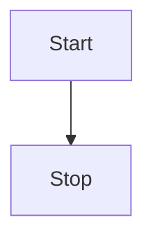

## Using the Mermaid component

This is how you write mermaid diagrams.

<Mermaid
  chart="
graph TD;
subgraph AA [Consumers]
A[Mobile app];
B[Web app];
C[Node.js client];
end
subgraph BB [Services]
E[REST API];
F[GraphQL API];
G[SOAP API];
end
Z[GraphQL API];
A --> Z;
B --> Z;
C --> Z;
Z --> E;
Z --> F;
Z --> G;"
/>

## Using mermaid syntax

This is how you write mermaid diagrams using the mermaid syntax.

